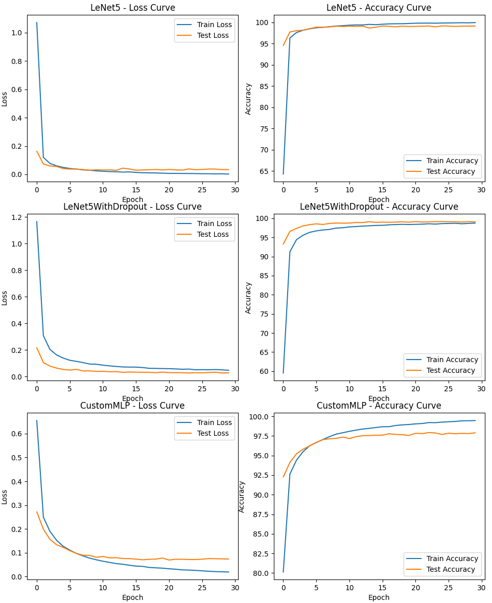

# 인공신경망과 딥러닝 HW#2

LeNet-5와 Custom MLP를 사용한 MNIST Classification
이 프로젝트의 목적은 LeNet-5와 사용자 정의 Multi-Layer Perceptron (MLP)의 두 가지 신경망 아키텍처를 사용하여 MNIST 데이터셋을 분류하는 것입니다. 모델은 PyTorch를 사용하여 구현되며 MNIST 데이터셋에서 학습됩니다.

## Dataset
MNIST 데이터셋은 28x28 픽셀 크기의 손글씨 숫자 이미지 70,000개로 구성되어 있습니다. 데이터셋은 60,000개의 학습 이미지와 10,000개의 테스트 이미지로 나누어집니다.

## 모델
### LeNet-5
LeNet-5는 1998년 Yann LeCun 등이 제안한 합성곱 신경망(CNN) 아키텍처입니다.
이 프로젝트에서 사용된 LeNet-5 모델의 아키텍처는 다음과 같습니다:

- Conv1: 1 input channel, 6 output channels, kernel size 5, stride 1
- ReLU1
- MaxPool1: kernel size 2
- Conv2: 6 input channels, 16 output channels, kernel size 5, stride 1
- ReLU2
- MaxPool2: kernel size 2
- FC1: 400 input features, 120 output features
- ReLU3
- FC2: 120 input features, 84 output features
- ReLU4
- FC3: 84 input features, 10 output features
  
- 156 + 2,416 + 48,120 + 10,164 + 850 = 61,706
- LeNet-5 모델의 총 파라미터 수는 61,706개입니다.

### Custom MLP
Custom MLP 모델은 한 개의 은닉층을 가진 단순한 피드포워드 신경망입니다. 각 은닉층 다음에는 ReLU 활성화 함수가 있습니다. Custom MLP의 아키텍처는 다음과 같습니다:

- FC1: 1024 input features (32x32 flattened), 58 output features 
- ReLU1
- FC2: 58 input features, 29 output features
- ReLU2
- FC3: 29 input features, 10 output features
  
- 59,392 + 1,682 + 290 = 61,364
- Custom MLP 모델의 총 파라미터 수는 61,393개입니다.

### LeNet-5 with Regularization
LeNet-5 with Regularization은 기본 LeNet-5 모델에 Regularization 기법을 적용한 버전입니다. 이 모델에는 다음과 같은 Regularization 기법이 적용되었습니다:

1. Dropout: 모델의 과적합을 방지하고 일반화 성능을 향상시키기 위해 fully connected layer 사이에 Dropout 레이어를 추가하였습니다. Dropout은 학습 중에 일부 뉴런을 임의로 비활성화하여 모델이 특정 뉴런에 과도하게 의존하는 것을 방지합니다.
   
2. L2 Regularization (Weight Decay): 모델의 가중치에 대한 L2 norm의 제곱을 손실 함수에 추가하는 L2 regularization을 적용하였습니다. 이는 가중치의 크기를 제한하여 모델의 복잡도를 줄이고 과적합을 방지하는 데 도움이 됩니다. LeNet-5 with Regularization 모델은 기본 LeNet-5 모델과 동일한 아키텍처를 가지고 있지만, Dropout 레이어가 추가되고 L2 regularization이 적용된 점이 다릅니다. 이러한 regularization 기법을 통해 모델의 일반화 성능을 높이고 과적합을 방지할 수 있습니다.

## Training & Evaluation
세 모델 모두 CrossEntropy loss 함수와 Learning late: 0.01, Momentum: 0.9의 확률적 경사 하강법(SGD) Optimizer를 사용하여 epoch 30으로 학습을 진행하였습니다.

|            Model            | Training Accuracy | Test Accuracy |
|:---------------------------:|:-----------------:|:-------------:|
|         **LeNet-5**         |     **99.94%**    |   **99.14%**  |
| LeNet-5 with Regularization |       98.74%      |     99.09%    |
|          Custom MLP         |       99.47%      |     97.90%    |

### Evaluation Plot

## Conclusion
- 본 프로젝트에서는 MNIST 데이터셋 분류를 위해 LeNet-5, LeNet-5 with Regularization, Custom MLP의 세 가지 신경망 아키텍처를 구현하고 비교하였습니다.
- 모든 모델이 MNIST 데이터셋에서 높은 정확도를 달성하였지만, LeNet-5와 LeNet-5 with Regularization이 Custom MLP보다 우수한 성능을 보였습니다. 특히 LeNet-5는 99.14%의 가장 높은 테스트 정확도를 달성하였습니다.
- LeNet-5 with Regularization 모델은 과적합을 방지하고 일반화 성능을 향상시키기 위해 Dropout과 L2 Regularization 기법을 적용하였습니다. 그러나 실험 결과, LeNet-5 with Regularization의 성능이 기본 LeNet-5 모델에 비해 소폭 감소한 것을 확인할 수 있었습니다. 이는 다음과 같은 이유로 설명될 수 있습니다:
  1. 모델의 표현력 감소: Regularization 기법을 적용하면 모델의 표현력이 제한될 수 있습니다. Dropout은 학습 중 일부 뉴런을 비활성화하고, L2 Regularization은 가중치의 크기를 제한하므로, 모델의 용량이 감소합니다. 이로 인해 모델이 데이터의 복잡한 패턴을 학습하는 데 어려움을 겪을 수 있습니다.
  2. 데이터셋의 특성: MNIST 데이터셋은 비교적 간단한 데이터셋으로, 높은 정확도를 달성하기 쉽습니다. 이러한 경우, Regularization 기법의 효과가 두드러지게 나타나지 않을 수 있습니다.

## Reference
- LeCun, Y., Bottou, L., Bengio, Y., & Haffner, P. (1998). Gradient-based learning applied to document recognition. Proceedings of the IEEE, 86(11), 2278-2324.
